# WorkplaceThinker Agent Architecture

This diagram shows the full agent loop: user inputs become evidence-grounded
memory, the agent reasons with an LLM under schema and evidence constraints, and
the UI renders a relationship/risk graph that the user can correct.

```mermaid
flowchart LR
    User["Early-career user"]

    subgraph Inputs["Input Carriers"]
        Chat["Chat observations"]
        Uploads["Uploaded docs\nemails, notes, plans"]
        Org["Org chart\nroles, teams, managers"]
        Feedback["User feedback\nconfirm, reject, edit"]
    end

    subgraph DocThinker["DocThinker Substrate"]
        Ingest["Upload / chat ingest"]
        Evidence["Evidence store\nstable evidence ids"]
        SessionMemory["Session memory\ncurrent case context"]
        LongMemory["Long-horizon memory\nrecurring workplace patterns"]
        KG["Knowledge graph\nentities, docs, events"]
    end

    subgraph Extractor["Deterministic Candidate Layer"]
        Seg["Evidence segmentation"]
        People["People + org extraction"]
        RelationRules["Relation candidates\nformal, support, collaboration,\nchallenge, commitment"]
        RiskRules["Risk signal candidates\nownership ambiguity,\ninformation asymmetry,\nprocess bypass,\ncredit/blame, pressure"]
    end

    subgraph Agent["Workplace Insight Agent"]
        Planner["Analysis planner\nwhat to inspect"]
        PromptBuilder["Evidence-constrained\nLLM prompt builder"]
        LLM["LLM reasoning\nsoft relation interpretation"]
        Validator["Schema + evidence validator\nno evidence, no claim"]
        Hypothesis["Hidden hypothesis builder\nhypothesis_not_fact"]
    end

    subgraph Graph["Relationship Graph Assembly"]
        Nodes["Nodes\nPerson, Team, Project,\nRiskSignal, Hypothesis"]
        Edges["Edges\nreports_to, collaborates,\nsupports, blocks, commits,\nevidenced_by"]
        Scoring["Confidence scoring\nfrequency + severity + LLM confidence"]
    end

    subgraph UI["User-Facing Graph UI"]
        Radar["Workplace Radar graph"]
        RiskCards["Risk cards\nwith evidence snippets"]
        Questions["Recommended confirmation questions"]
        Controls["Memory controls\nremember, exclude, delete,\npromote confirmed facts"]
    end

    User --> Chat
    User --> Uploads
    User --> Org
    User --> Feedback

    Chat --> Ingest
    Uploads --> Ingest
    Org --> People
    Feedback --> SessionMemory
    Feedback --> LongMemory

    Ingest --> Evidence
    Ingest --> KG
    Evidence --> SessionMemory
    SessionMemory --> LongMemory

    Evidence --> Seg
    Seg --> People
    Seg --> RelationRules
    Seg --> RiskRules
    KG --> People
    LongMemory --> Planner

    People --> Planner
    RelationRules --> Planner
    RiskRules --> Planner
    Planner --> PromptBuilder
    Evidence --> PromptBuilder
    Org --> PromptBuilder
    PromptBuilder --> LLM
    LLM --> Validator
    RelationRules --> Validator
    RiskRules --> Validator
    Validator --> Hypothesis

    Validator --> Nodes
    Validator --> Edges
    Hypothesis --> Nodes
    Hypothesis --> Edges
    Nodes --> Scoring
    Edges --> Scoring

    Scoring --> Radar
    Scoring --> RiskCards
    Hypothesis --> RiskCards
    Validator --> Questions
    Radar --> Controls
    RiskCards --> Controls
    Questions --> Controls
    Controls --> Feedback
```



## Layer Responsibilities

### 1. Input Carriers

The user provides messy workplace context:

- chat observations and private notes;
- uploaded emails, meeting notes, project docs, screenshots converted to text;
- organization chart with people, teams, roles, and reporting lines;
- feedback on whether a relationship or hypothesis is correct.

### 2. DocThinker Substrate

DocThinker stays as the lower-level engine:

- ingestion for text and multimodal carriers;
- session-scoped evidence and knowledge graph;
- short-horizon session memory;
- long-horizon agentic memory for recurring workplace patterns.

### 3. Deterministic Candidate Layer

Before any LLM call, WorkplaceThinker builds stable candidates:

- evidence ids;
- people and organization matches;
- relationship candidates;
- risk signal candidates.

This makes the result auditable and keeps the LLM from inventing unsupported
people or claims.

### 4. Workplace Insight Agent

The LLM is used as a constrained reasoning component, not an unconstrained judge.
It receives evidence ids, org chart, candidate edges, candidate risks, and an
output schema. The validator rejects or downgrades any claim without evidence.

### 5. Graph Assembly

The graph merges formal organization structure with observed workplace signals:

- blue edges: formal org relationships;
- sage edges: support and collaboration;
- copper dashed edges: risk signals;
- plum dotted edges: hidden hypotheses.

### 6. User Feedback Loop

The user can confirm, reject, or edit graph items. Confirmed items can become
durable memory; rejected hypotheses should be remembered as corrections.

## Core Rule

WorkplaceThinker separates fact from hypothesis:

```text
observed fact -> evidence-backed graph item
possible hidden issue -> hypothesis_not_fact
advice -> neutral confirmation question
```

