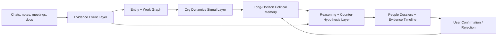

# Long-Horizon Organizational Dynamics Architecture

This document defines how WorkplaceThinker should understand "organizational
politics" as a long-horizon reasoning problem. In this product, "politics" does
not mean manipulation, factional advice, or unsupported judgment about people.
It means modeling observable flows of authority, information, resources, credit,
responsibility, and risk over time.

The core idea:

```text
single message = weak signal
repeated evidence across time = pattern candidate
user-confirmed repeated pattern = durable workplace memory
durable memory + current evidence = safer long-horizon judgment
```

## Product Boundary

WorkplaceThinker should help the user see structure without becoming paranoid.

It can say:

- "This looks like a possible responsibility-transfer pattern. Here is the
  evidence and what to confirm."
- "The formal owner and the actual decision channel appear different."
- "Credit, resource, and accountability signals are moving through different
  people."
- "This is only a hypothesis because the evidence is indirect."

It should not say:

- "This person is bad / selfish / manipulative."
- "You should join this faction."
- "You should retaliate, threaten, or expose someone."
- "This hidden motive is definitely true."
- "Use this tactic to control a colleague."

## Layered Architecture



### 1. Evidence Event Layer

Organizational dynamics must start from events, not impressions. Every observed
piece of workplace context should become an event with enough metadata for
future comparison.

Recommended fields:

```python
class EvidenceEvent(TypedDict):
    evidence_id: str
    source_type: Literal["chat", "meeting_note", "upload", "manual_note", "memory"]
    source_ref: str | None
    timestamp: str | None
    speaker: str | None
    quoted_people: list[str]
    channel: str | None
    visibility: Literal["public", "private", "unknown"]
    directness: Literal["direct_observation", "reported", "inferred"]
    text: str
    sensitivity: Literal["low", "medium", "high"]
```

Why this matters:

- A private aside and a public project-group decision should not be weighted the
  same way.
- A repeated direct observation is stronger than a one-time rumor.
- Long-horizon reasoning needs timestamps to know whether a pattern is active,
  decaying, or stale.

### 2. Entity + Work Graph

"懂政治" is not only about people. It is about people around work objects.

Core entities:

- `Person`: individual actor.
- `Team`: formal or informal group.
- `Role`: product owner, manager, reviewer, approver, IC, sponsor.
- `WorkObject`: project, task, decision, approval, deliverable, deadline,
  acceptance criterion.
- `Resource`: headcount, time, budget, permission, data, access, dependency.
- `Outcome`: launch, review, delay, incident, blame, recognition, promotion,
  performance pressure.

Core edges:

- `reports_to`: formal reporting line.
- `owns_work`: person is named owner / driver / DRI.
- `approves_work`: person has authority or veto.
- `controls_resource`: person or team controls required resource.
- `requests_work`: person asks another to do work.
- `transfers_responsibility`: responsibility moves from one actor to another.
- `claims_credit`: actor publicly attaches self to successful outcome.
- `assigns_blame`: actor attaches another person to failure or risk.
- `bypasses_process`: decision or approval happens outside normal channel.
- `withholds_information`: required information is not shared with affected
  people.

### 3. Org Dynamics Signal Layer

Signals are local observations. They are not final conclusions.

Recommended signal schema:

```python
class OrgDynamicsSignal(TypedDict):
    signal_id: str
    kind: Literal[
        "information_gatekeeping",
        "shadow_decision_chain",
        "sponsorship_or_backing",
        "credit_capture",
        "blame_shift",
        "resource_control",
        "coalition_signal",
        "performance_pressure_transfer",
        "authority_responsibility_mismatch",
        "process_exception"
    ]
    actors: list[str]
    work_objects: list[str]
    evidence_ids: list[str]
    directness: Literal["direct", "mixed", "indirect"]
    confidence: float
    status: Literal["signal_not_fact"]
    interpretation: str
    safe_confirmation_question: str
```

Signal examples:

| Signal | What it means | Safe question |
| --- | --- | --- |
| `information_gatekeeping` | A person controls access to context needed by others. | "Who else needs to be synchronized before we proceed?" |
| `shadow_decision_chain` | Real decisions appear to happen outside the formal channel. | "Can we capture the decision owner and approval path in the project thread?" |
| `credit_capture` | Public recognition attaches to a person who did not own the work. | "How should we document contributors and final owners?" |
| `blame_shift` | Risk or failure is being attached downward or sideways. | "Can we clarify owner, approver, and acceptance criteria before execution?" |
| `authority_responsibility_mismatch` | The user carries responsibility without matching authority. | "What scope and decision rights come with this responsibility?" |

### 4. Long-Horizon Political Memory

Long-horizon organizational reasoning needs memory that is structured,
inspectable, and correctable.

Recommended memory objects:

```python
class OrgDynamicsPattern(TypedDict):
    pattern_id: str
    kind: str
    actors: list[str]
    work_object_types: list[str]
    first_seen: str | None
    last_seen: str | None
    evidence_ids: list[str]
    source_diversity: int
    recurrence_count: int
    contradiction_count: int
    user_confirmations: int
    user_rejections: int
    confidence: float
    status: Literal[
        "pattern_candidate",
        "confirmed_pattern",
        "rejected_pattern",
        "stale_pattern"
    ]
    summary: str
    next_verification_step: str
```

```python
class ResponsibilityFlow(TypedDict):
    flow_id: str
    work_object_id: str
    from_actor: str | None
    to_actor: str
    responsibility_type: Literal["execution", "approval", "risk", "credit", "blame"]
    evidence_ids: list[str]
    timestamp: str | None
    status: Literal["observed", "hypothesized", "confirmed", "rejected"]
```

```python
class PoliticalMemory(TypedDict):
    person_profiles: dict[str, dict]
    relationship_history: list[dict]
    org_dynamics_patterns: list[OrgDynamicsPattern]
    responsibility_flows: list[ResponsibilityFlow]
    resource_control_map: list[dict]
    decision_history: list[dict]
    user_corrections: list[dict]
```

Memory should store what happened and what the user confirmed, not personality
labels. A person profile may contain "observed patterns around work", but should
not contain "personality type" unless the user explicitly provides it as their
own note.

### 5. Pattern Scoring

Pattern scoring should be conservative. A single strong message can create a
signal, but not a durable political pattern.

Suggested factors:

| Factor | Effect |
| --- | --- |
| Recurrence | Repeated similar signals increase confidence. |
| Recency | Recent signals matter more than stale ones. |
| Source diversity | Signals from different channels / documents are stronger. |
| Directness | Direct observations are stronger than reported claims. |
| Role relevance | Signals involving formal owners / approvers carry more weight. |
| User confirmation | Explicit confirmation greatly increases confidence. |
| Contradiction | Conflicting evidence lowers confidence or splits hypotheses. |
| Severity | High-impact responsibility, credit, or performance signals get surfaced sooner. |

Example scoring shape:

```text
pattern_score =
  recurrence_weight
  + recency_weight
  + source_diversity_weight
  + directness_weight
  + user_confirmation_weight
  + severity_weight
  - contradiction_penalty
  - stale_memory_penalty
```

Confidence thresholds:

- `0.00 - 0.35`: keep as low-confidence signal.
- `0.35 - 0.65`: show as pattern candidate with missing evidence.
- `0.65 - 0.85`: show as likely recurring pattern, still not fact.
- `0.85+`: only if supported by repeated evidence and user confirmation.

### 6. Reasoning Layer

The reasoning layer should separate four things:

```text
fact -> interpretation -> hypothesis -> action
```

For each important output, the system should return:

- observed facts;
- interpretation with uncertainty;
- alternative explanations;
- missing evidence;
- safe confirmation questions;
- user-control actions.

Recommended output shape:

```python
class OrgDynamicsReasoningResult(TypedDict):
    org_dynamics_signals: list[OrgDynamicsSignal]
    org_dynamics_patterns: list[OrgDynamicsPattern]
    power_map: list[dict]
    responsibility_chain: list[ResponsibilityFlow]
    alternative_explanations: list[str]
    missing_evidence: list[str]
    safe_next_questions: list[str]
    prohibited_actions_filtered: list[str]
```

Counter-hypothesis examples:

- A delayed update may be workload pressure, not information gatekeeping.
- A private conversation may be normal escalation, not shadow decision-making.
- A changed owner may reflect legitimate scope changes, not blame shifting.
- Credit wording may be sloppy communication, not intentional credit capture.

### 7. UI and Control Layer

The UI should make long-horizon dynamics inspectable.

Recommended views:

- **People directory**: list all people, then click into each dossier.
- **Person dossier**: current evidence, historical patterns, work links,
  relationship changes, corrections.
- **Evidence timeline**: chronological events grouped by person, project, and
  signal kind.
- **Responsibility chain**: who requested, who approved, who executed, who
  accepted, who received credit, who absorbed risk.
- **Decision trail**: formal decisions versus private side-channel decisions.
- **Resource map**: who controls budget, access, time, data, or dependency.
- **Correction controls**: confirm, reject, mark stale, exclude from memory,
  delete evidence.

Every political-pattern card should display:

- status: signal, candidate pattern, confirmed pattern, rejected pattern;
- evidence ids;
- first seen and last seen;
- confidence and why;
- missing evidence;
- safe question to ask next;
- memory controls.

## Knowledge Injection

"讲政治" requires prior knowledge packs, but those packs must stay grounded and
auditable.

Recommended knowledge packs:

1. **Responsibility and authority**
   - RACI, DRI, owner / approver / reviewer / informed.
   - Authority-responsibility mismatch.
   - Acceptance criteria and written approval.

2. **Decision systems**
   - Formal decision record.
   - Shadow decision chain.
   - Process exception.
   - Reversible versus irreversible decision.

3. **Resource control**
   - Budget, headcount, engineering capacity, data access, customer access.
   - Dependency bottlenecks.
   - Queue priority and hidden cost.

4. **Credit and blame flow**
   - Contributor visibility.
   - Credit capture.
   - Blame shifting.
   - Incident ownership.

5. **Information flow**
   - Need-to-know versus gatekeeping.
   - Public channel versus private channel.
   - Alignment language, version drift, missing stakeholders.

6. **Power and sponsorship**
   - Formal manager.
   - Informal sponsor.
   - Cross-team backing.
   - Escalation path.

7. **Internet workplace language**
   - "Align", "close the loop", "owner", "push", "blocker", "empower",
     "leverage", "breakdown", "review", "沉淀", "抓手", "打法", "闭环".
   - Each term should map to real work implications, not stereotypes.

## Implementation Roadmap

### P0: Current Foundation

- Keep existing `org_dynamics_signals`.
- Keep knowledge-injected reasoning frames.
- Keep person dossiers and work graph.
- Add this architecture as the target design.

### P1: Event Store Upgrade

- Add timestamps, source type, channel, visibility, speaker, directness, and
  sensitivity to evidence.
- Store evidence as append-only events.
- Make memory deletion remove or tombstone related events.

### P2: Pattern Consolidation

- Merge repeated signals into `OrgDynamicsPattern`.
- Add recurrence, recency, contradiction, and user-confirmation scoring.
- Add stale-pattern decay so old impressions do not dominate current analysis.

### P3: Responsibility and Power Maps

- Add `ResponsibilityFlow` and `resource_control_map`.
- Render responsibility chains in the UI.
- Add decision trail and resource map sections.

### P4: Counter-Hypothesis Validator

- Require at least one alternative explanation for every medium/high-risk
  political pattern.
- Downgrade patterns that lack direct evidence.
- Make unsupported personality and motive claims fail validation.

### P5: User-Controlled Memory

- Add per-pattern confirm / reject / stale / delete controls.
- Let users exclude sensitive people, projects, or channels from long-term
  memory.
- Show "why am I seeing this?" for every durable pattern.

## Non-Negotiable Guardrails

- No evidence, no strong claim.
- Signals are not facts.
- Patterns are not personality labels.
- Motives are hypotheses, not conclusions.
- Long-horizon memory must be inspectable and deletable.
- Advice should favor clarity, documentation, boundary setting, and neutral
  confirmation.
- The system should never recommend manipulation, factional escalation,
  retaliation, harassment, or covert information gathering.

